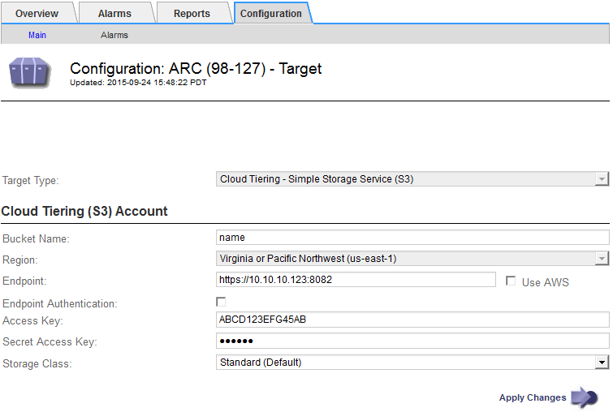

= Configure los ajustes de conexión para la API de S3
:allow-uri-read: 
:icons: font
:imagesdir: ../media/

[role="lead"]
Si se conecta a un nodo de archivado con la interfaz de S3, debe configurar los ajustes de conexión para la API de S3. Hasta que se hayan configurado estos ajustes, el servicio ARC permanecerá en un estado de alarma principal, ya que no puede comunicarse con el sistema de almacenamiento de archivos externo.

[CAUTION]
====
La compatibilidad con los nodos de archivo está obsoleta y se eliminará en una versión futura. El traslado de objetos de un nodo de archivado a un sistema de almacenamiento de archivado externo a través de la API de S3 ha sido sustituido por los pools de almacenamiento en cloud de ILM, que ofrecen más funcionalidades.

La opción Cloud Tiering - Simple Storage Service (S3) también queda obsoleta. Si está utilizando un nodo de archivado con esta opción, link:../admin/migrating-objects-from-cloud-tiering-s3-to-cloud-storage-pool.html["Migre sus objetos a un pool de almacenamiento en la nube"] en su lugar.

Además, debe eliminar los nodos de archivado de la política de gestión de la vida útil de la información activa en StorageGRID 11,7 o versiones anteriores. La eliminación de datos de objetos almacenados en nodos de archivado simplificará las actualizaciones futuras. Consulte link:../ilm/working-with-ilm-rules-and-ilm-policies.html["Trabajar con reglas de ILM y políticas de ILM"].

====
.Antes de empezar
* Ha iniciado sesión en Grid Manager mediante un link:../admin/web-browser-requirements.html["navegador web compatible"].
* Ya tienes link:admin-group-permissions.html["permisos de acceso específicos"].
* Ha creado un bucket en el sistema de almacenamiento de archivado de destino:
+
** El bloque está dedicado a un único nodo de archivado. No puede ser utilizado por otros nodos de archivo u otras aplicaciones.
** El cucharón tiene la región adecuada seleccionada para su ubicación.
** El bloque debe configurarse con el control de versiones suspendido.

* La segmentación de objetos está activada y el tamaño máximo de segmento es menor o igual a 4.5 GIB (4,831,838,208 bytes). Las solicitudes de API S3 que superen este valor fallarán si se usa S3 como sistema de almacenamiento de archivado externo.

.Pasos
. Seleccione *SUPPORT* > *Tools* > *Topología de cuadrícula*.
. Seleccione *nodo de archivo* > *ARC* > *objetivo*.
. Seleccione *Configuración* > *Principal*.
+

. Seleccione *Cloud Tiering - simple Storage Service (S3)* en la lista desplegable Target Type.
+

NOTE: Los ajustes de configuración no estarán disponibles hasta que seleccione un tipo de destino.

. Configure la cuenta de organización en niveles de cloud (S3) a través de la cual el nodo de archivado se conectará al sistema de almacenamiento de archivado externo compatible con S3 de destino.
+
La mayoría de los campos en esta página son claros y explicativos. A continuación, se describen los campos que podrían presentar dificultades.

+
** *Región*: Sólo está disponible si se selecciona *usar AWS*. La región que seleccione debe coincidir con la región del bloque.
** *Endpoint* y *Use AWS*: Para Amazon Web Services (AWS), seleccione *usar AWS*. *Endpoint* se rellena automáticamente con una dirección URL de extremo basada en los atributos Nombre de bloque y Región. Por ejemplo:
+
`\https://bucket.region.amazonaws.com`

+
En el caso de un destino que no sea AWS, introduzca la URL del sistema que aloja el bloque, incluido el número de puerto. Por ejemplo:

+
`\https://system.com:1080`

** *Autenticación de punto final*: Activada de forma predeterminada. Si la red al sistema de almacenamiento de archivado externo es de confianza, puede desactivar la casilla de verificación para desactivar el certificado SSL de punto final y la verificación de nombre de host para el sistema de almacenamiento de archivado externo de destino. Si otra instancia de un sistema StorageGRID es el dispositivo de almacenamiento de archivado de destino y el sistema está configurado con certificados firmados públicamente, puede mantener la casilla de verificación seleccionada.
** *Clase de almacenamiento*: Seleccione *Estándar (predeterminado)* para almacenamiento normal. Seleccione *redundancia reducida* sólo para objetos que se puedan volver a crear fácilmente. *Redundancia reducida* proporciona almacenamiento de menor costo con menos confiabilidad. Si el sistema de almacenamiento de archivado objetivo es otra instancia del sistema StorageGRID, *clase de almacenamiento* controla cuántas copias provisionales del objeto se realizan durante el procesamiento en el sistema de destino, si se utiliza el COMMIT doble cuando se ingieren objetos allí.

. Seleccione *aplicar cambios*.
+
Los ajustes de configuración especificados se validan y se aplican al sistema StorageGRID. Después de aplicar la configuración, el destino no se puede cambiar.

