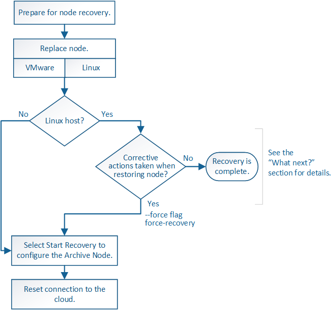

= Recuperación de fallos de nodo de archivado: Flujo de trabajo
:allow-uri-read: 
:icons: font
:imagesdir: ../media/

[role="lead"]
Debe completar una secuencia de tareas para poder recuperarlas de un fallo en el nodo de archivado.

La recuperación del nodo de archivado se ve afectada por los siguientes problemas:

* Si la política de ILM se configura para replicar una sola copia.
+
En un sistema StorageGRID configurado para realizar una única copia de objetos, un error de nodo de archivado puede provocar una pérdida de datos irrecuperable. Si se produce un fallo, se pierden todos esos objetos; sin embargo, debe realizar procedimientos de recuperación para limpiar el sistema StorageGRID y depurar la información de objetos perdidos de la base de datos.

* Si se produce un fallo de un nodo de archivado durante la recuperación del nodo de almacenamiento.
+
Si el nodo de archivado falla al procesar recuperaciones masivas como parte de una recuperación de Storage Node, Debe repetir el procedimiento para recuperar copias de los datos del objeto en el nodo de almacenamiento desde el principio para garantizar que todos los datos del objeto recuperados del nodo de archivado se restauren en el nodo de almacenamiento.

