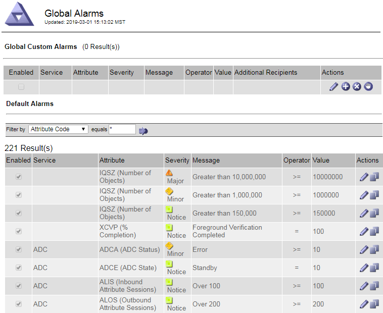
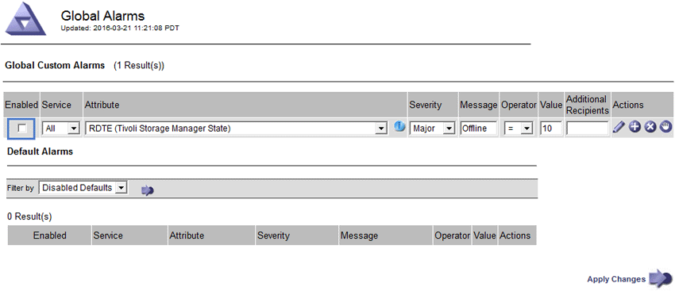

= Gestionar alarmas (sistema heredado)
:allow-uri-read: 
:icons: font
:imagesdir: ../media/

[role="lead"]
El sistema de alarma StorageGRID es el sistema heredado utilizado para identificar puntos problemáticos que a veces ocurren durante el funcionamiento normal.

NOTE: Aunque el sistema de alarma heredado sigue siendo compatible, el sistema de alerta ofrece importantes ventajas y es más fácil de usar.

== Clases de alarma (sistema heredado)

Una alarma heredada puede pertenecer a una de las dos clases de alarma mutuamente excluyentes.

* Las alarmas predeterminadas se proporcionan con cada sistema StorageGRID y no se pueden modificar. Sin embargo, puede desactivar las alarmas predeterminadas o anularlas definiendo las alarmas personalizadas globales.
* Las alarmas personalizadas globales controlan el estado de todos los servicios de un tipo determinado en el sistema StorageGRID. Puede crear una alarma Global Custom para anular una alarma predeterminada. También puede crear una nueva alarma Global Custom. Esto puede ser útil para supervisar cualquier condición personalizada de su sistema StorageGRID.

== Lógica de activación de alarmas (sistema heredado)

Una alarma heredada se activa cuando un atributo StorageGRID alcanza un valor de umbral que se evalúa como verdadero frente a una combinación de clase de alarma (predeterminada o personalizada global) y nivel de gravedad de alarma.

[cols="1a,1a,1a,3a"]
|===
| . | Color | Gravedad de alarma | Significado 

 a| 
image:../media/icon_alarm_yellow_notice.gif["icono cuadrado amarillo"]
 a| 
Amarillo
 a| 
Aviso
 a| 
El nodo está conectado a la cuadrícula, pero existe una condición poco habitual que no afecta a las operaciones normales.

 a| 
image:../media/icon_alert_yellow_minor.png["icono de diamante naranja claro"]
 a| 
Naranja claro
 a| 
Menor
 a| 
El nodo está conectado a la cuadrícula, pero existe una condición anormal que podría afectar al funcionamiento en el futuro. Debe investigar para evitar el escalado.

 a| 
image:../media/icon_alert_orange_major.png["icono de diamante naranja oscuro"]
 a| 
Naranja oscuro
 a| 
Importante
 a| 
El nodo está conectado a la cuadrícula, pero existe una condición anormal que afecta actualmente al funcionamiento. Esto requiere atención inmediata para evitar un escalado.

 a| 
image:../media/icon_alert_red_critical.png["icono rojo x"]
 a| 
Rojo
 a| 
Crítico
 a| 
El nodo está conectado a la cuadrícula, pero existe una condición anormal que ha detenido las operaciones normales. Debe abordar el problema de inmediato.

|===
La gravedad de la alarma y el valor del umbral correspondiente se pueden establecer para cada atributo numérico. El servicio NMS de cada nodo de administración supervisa continuamente los valores de atributos actuales en función de los umbrales configurados. Cuando se activa una alarma, se envía una notificación a todo el personal designado.

Tenga en cuenta que un nivel de gravedad normal no desencadena una alarma.

Los valores de los atributos se evalúan en relación con la lista de alarmas activadas definidas para ese atributo. La lista de alarmas se Marca en el siguiente orden para encontrar la primera clase de alarma con una alarma definida y activada para el atributo:

. Alarmas personalizadas globales con niveles de alarma desde críticos hasta avisos.
. Alarmas predeterminadas con límites de alarma desde crítica hasta Aviso.

Después de que se encuentre una alarma activada para un atributo en la clase de alarma superior, el servicio NMS sólo evalúa dentro de esa clase. El servicio NMS no se evaluará en comparación con las otras clases de menor prioridad. Es decir, si hay una alarma Global Custom activada para un atributo, el servicio NMS sólo evalúa el valor del atributo frente a las alarmas Global Custom. Las alarmas predeterminadas no se evalúan. Por lo tanto, una alarma predeterminada activada para un atributo puede cumplir los criterios necesarios para activar una alarma, pero no se activará porque se activa una alarma personalizada global (que no cumple los criterios especificados) para el mismo atributo. No se activa ninguna alarma y no se envía ninguna notificación.

=== Ejemplo de activación de alarma

Puede utilizar este ejemplo para entender cómo se activan las alarmas personalizadas globales y las alarmas predeterminadas.

En el ejemplo siguiente, un atributo tiene una alarma Global Custom y una alarma predeterminada definida y activada, como se muestra en la siguiente tabla.

[cols="1a,2a,2a"]
|===
|  | Umbral de alarma global personalizada (activado) | Umbral de alarma predeterminado (activado) 

 a| 
Aviso
 a| 
>= 1500
 a| 
>= 1000

 a| 
Menor
 a| 
>= 15.000
 a| 
>= 1000

 a| 
Importante
 a| 
>=150,000
 a| 
>= 250.000

|===
Si el atributo se evalúa cuando su valor es 1000, no se activa ninguna alarma y no se envía ninguna notificación.

La alarma Global Custom tiene prioridad sobre la alarma predeterminada. Un valor de 1000 no alcanza el valor umbral de ningún nivel de gravedad para la alarma Global Custom. Como resultado, el nivel de alarma se evalúa para ser normal.

Después de la situación anterior, si la alarma Global Custom está desactivada, no cambia nada. El valor del atributo se debe volver a evaluar antes de que se active un nuevo nivel de alarma.

Con la alarma Global Custom desactivada, cuando se vuelve a evaluar el valor del atributo, el valor del atributo se evalúa frente a los valores de umbral de la alarma predeterminada. El nivel de alarma activa una alarma de nivel de aviso y se envía una notificación por correo electrónico al personal designado.

=== Alarmas de la misma gravedad

Si dos alarmas personalizadas globales para el mismo atributo tienen la misma gravedad, las alarmas se evalúan con una prioridad descendente.

Por ejemplo, si UMEM cae a 50 MB, se activa la primera alarma (= 50000000), pero no la que está debajo de ella (\<=100000000).

image::../media/alarm_order.gif[Ejemplo de alarma personalizada global]

Si el orden se invierte, cuando UMEM cae a 100MB, se activa la primera alarma (\<=100000000), pero no la que está por debajo (= 50000000).

image::../media/alarm_order_reversed.gif[Ejemplo de alarma personalizada global]

=== Notificaciones

Una notificación informa de la aparición de una alarma o del cambio de estado de un servicio. Las notificaciones de alarma se pueden enviar por correo electrónico o mediante SNMP.

Para evitar que se envíen varias alarmas y notificaciones cuando se alcance un valor de umbral de alarma, se comprueba la gravedad de la alarma con respecto a la gravedad actual del atributo. Si no hay cambio, no se toman medidas adicionales. Esto significa que, a medida que el servicio NMS siga supervisando el sistema, sólo generará una alarma y enviará notificaciones la primera vez que observe una condición de alarma para un atributo. Si se alcanza y se detecta un nuevo umbral de valor para el atributo, la gravedad de la alarma cambia y se envía una nueva notificación. Las alarmas se borran cuando las condiciones vuelven al nivel normal.

El valor del disparador que se muestra en la notificación de un estado de alarma se redondea a tres posiciones decimales. Por lo tanto, un valor de atributo de 1.9999 activa una alarma cuyo umbral es inferior a (<) 2.0, aunque la notificación de alarma muestra el valor de activación como 2.0.

=== Nuevos servicios

A medida que se agregan nuevos servicios mediante la adición de nuevos nodos de cuadrícula o sitios, heredan las alarmas predeterminadas y las alarmas personalizadas globales.

=== Alarmas y tablas

Los atributos de alarma que se muestran en las tablas se pueden desactivar a nivel del sistema. Las alarmas no se pueden desactivar para filas individuales de una tabla.

Por ejemplo, en la siguiente tabla se muestran dos alarmas de entradas críticas disponibles (VMFI). (Seleccione *SUPPORT* > *Tools* > *Topología de cuadrícula*. A continuación, seleccione *_Storage Node_* > *SSM* > *Resources*.)

Puede desactivar la alarma VMFI para que no se active la alarma VMFI de nivel crítico (ambas alarmas críticas aparecerán en verde en la tabla); Sin embargo, no puede desactivar una sola alarma en una fila de tabla, de modo que una alarma VMFI se muestre como una alarma de nivel crítico mientras que la otra se mantenga verde.

image::../media/disabling_alarms.gif[Página volúmenes donde se muestran las alarmas críticas]

== Confirmar alarmas actuales (sistema heredado)

Las alarmas heredadas se activan cuando los atributos del sistema alcanzan valores de umbral de alarma. De forma opcional, si desea reducir o borrar la lista de alarmas heredadas, puede reconocer las alarmas.

.Antes de empezar
* Debe iniciar sesión en Grid Manager mediante un link:../admin/web-browser-requirements.html["navegador web compatible"].
* Debe tener el permiso de acuse de recibo de alarmas.

.Acerca de esta tarea
Dado que el sistema de alarmas heredado sigue siendo compatible, la lista de alarmas heredadas de la página Alarmas actuales aumenta cada vez que se produce una nueva alarma. Por lo general, puede ignorar las alarmas (ya que las alertas proporcionan una mejor vista del sistema) o puede confirmar las alarmas.

NOTE: De manera opcional, cuando haya pasado completamente al sistema de alertas, puede desactivar cada alarma heredada para evitar que se active y se agregue al recuento de alarmas heredadas.

Cuando reconoce una alarma, ésta ya no aparece en la página Alarmas actuales del Gestor de cuadrícula, a menos que la alarma se active en el siguiente nivel de gravedad o se resuelva y se vuelva a producir.

NOTE: Aunque el sistema de alarma heredado sigue siendo compatible, el sistema de alerta ofrece importantes ventajas y es más fácil de usar.

.Pasos
. Seleccione *SUPPORT* > *Alarms (Legacy)* > *Current Alarms*.
+
image::../media/current_alarms_page.png[Página Alarmas actuales]

. Seleccione el nombre del servicio en la tabla.
+
Aparece la ficha Alarmas para el servicio seleccionado (*SUPPORT* > *Tools* > *Topología de cuadrícula* > *_nodo de cuadrícula_* > *_Servicio_* > *Alarmas*).

+
image::../media/alarms_acknowledging.png[Confirmación de alarmas]

. Seleccione la casilla de verificación *Aceptar* para la alarma y haga clic en *Aplicar cambios*.
+
La alarma ya no aparece en el panel de control ni en la página Alarmas actuales.

+

NOTE: Cuando reconoce una alarma, la confirmación no se copia en otros nodos de administración. Por este motivo, si ve el panel de control desde otro nodo de administración, puede continuar viendo la alarma activa.

. Según sea necesario, vea las alarmas confirmadas.
+
.. Seleccione *SUPPORT* > *Alarms (Legacy)* > *Current Alarms*.
.. Seleccione *Mostrar alarmas aceptadas*.
+
Se muestran todas las alarmas confirmadas.

+
image::../media/current_alarms_page_show_acknowledged.png[Página de alarmas actuales Mostrar confirmadas]

== Ver alarmas predeterminadas (sistema heredado)

Puede ver la lista de todas las alarmas heredadas predeterminadas.

.Antes de empezar
* Debe iniciar sesión en Grid Manager mediante un link:../admin/web-browser-requirements.html["navegador web compatible"].
* Ya tienes link:../admin/admin-group-permissions.html["permisos de acceso específicos"].

NOTE: Aunque el sistema de alarma heredado sigue siendo compatible, el sistema de alerta ofrece importantes ventajas y es más fácil de usar.

.Pasos
. Seleccione *SUPPORT* > *Alarms (Legacy)* > *Global Alarms*.
. En filtro por, seleccione *Código de atributo* o *Nombre de atributo*.
. En el caso de igual a, introduzca un asterisco: `*`
. Haga clic en la flecha image:../media/icon_nms_right_arrow.gif["Icono de flecha"] O pulse *Intro*.
+
Se muestran todas las alarmas predeterminadas.

+

== Revisar las alarmas históricas y la frecuencia de las alarmas (sistema heredado)

Al solucionar un problema, puede revisar la frecuencia con la que se ha activado una alarma heredada en el pasado.

.Antes de empezar
* Debe iniciar sesión en Grid Manager mediante un link:../admin/web-browser-requirements.html["navegador web compatible"].
* Ya tienes link:../admin/admin-group-permissions.html["permisos de acceso específicos"].

NOTE: Aunque el sistema de alarma heredado sigue siendo compatible, el sistema de alerta ofrece importantes ventajas y es más fácil de usar.

.Pasos
. Siga estos pasos para obtener una lista de todas las alarmas activadas durante un período de tiempo.
+
.. Seleccione *SUPPORT* > *Alarms (Legacy)* > *Historical Alarms*.
.. Debe realizar una de las siguientes acciones:
+
*** Haga clic en uno de los períodos de tiempo.
*** Introduzca un rango personalizado y haga clic en *Consulta personalizada*.

. Siga estos pasos para averiguar con qué frecuencia se han activado las alarmas para un atributo determinado.
+
.. Seleccione *SUPPORT* > *Tools* > *Topología de cuadrícula*.
.. Seleccione *_Grid node_* > *_service o component_* > *Alarms* > *History*.
.. Seleccione el atributo de la lista.
.. Debe realizar una de las siguientes acciones:
+
*** Haga clic en uno de los períodos de tiempo.
*** Introduzca un rango personalizado y haga clic en *Consulta personalizada*.
+
Las alarmas se enumeran en orden cronológico inverso.

.. Para volver al formulario de solicitud del historial de alarmas, haga clic en *Historial*.

== Crear alarmas personalizadas globales (sistema heredado)

Es posible que haya utilizado alarmas personalizadas globales para el sistema heredado para atender requisitos de supervisión específicos. Las alarmas personalizadas globales pueden tener niveles de alarma que anulan las alarmas predeterminadas o pueden supervisar atributos que no tienen una alarma predeterminada.

.Antes de empezar
* Debe iniciar sesión en Grid Manager mediante un link:../admin/web-browser-requirements.html["navegador web compatible"].
* Ya tienes link:../admin/admin-group-permissions.html["permisos de acceso específicos"].

NOTE: Aunque el sistema de alarma heredado sigue siendo compatible, el sistema de alerta ofrece importantes ventajas y es más fácil de usar.

Las alarmas personalizadas globales anulan las alarmas predeterminadas. No debe cambiar los valores de alarma predeterminados a menos que sea absolutamente necesario. Al cambiar las alarmas predeterminadas, corre el riesgo de ocultar problemas que, de lo contrario, podrían desencadenar una alarma.

NOTE: Tenga cuidado si cambia los ajustes de alarma. Por ejemplo, si aumenta el valor del umbral de una alarma, es posible que no detecte un problema subyacente. Comente los cambios propuestos con el soporte técnico antes de cambiar la configuración de una alarma.

.Pasos
. Seleccione *SUPPORT* > *Alarms (Legacy)* > *Global Alarms*.
. Agregue una nueva fila a la tabla Alarmas globales personalizadas:
+
** Para añadir una nueva alarma, haga clic en *Editar* image:../media/icon_nms_edit.gif["icono editar"] (Si ésta es la primera entrada) o *Insertar* image:../media/icon_nms_insert.gif["insertar icono"].
+
image::../media/global_custom_alarms.gif[Página Global Alarms]

** Para modificar una alarma predeterminada, busque la alarma predeterminada.
+
... En Filtrar por, seleccione *código de atributo* o *Nombre de atributo*.
... Escriba una cadena de búsqueda.
+
Especifique cuatro caracteres o utilice caracteres comodín (por ejemplo, A???? O AB*). Asteriscos (*) representan múltiples caracteres y signos de interrogación (?) representa un solo carácter.

... Haga clic en la flecha image:../media/icon_nms_right_arrow.gif["icono de flecha derecha"]O pulse *Intro*.
... En la lista de resultados, haga clic en *Copiar* image:../media/icon_nms_copy.gif["icono de copia"] junto a la alarma que desea modificar.
+
La alarma predeterminada se copia en la tabla Alarmas globales personalizadas.

. Realice los cambios necesarios en la configuración de alarmas personalizadas globales:
+
[cols="1a,2a"]
|===
| Título | Descripción 

 a| 
Activado
 a| 
Active o desactive la casilla de verificación para activar o desactivar la alarma.

 a| 
Atributo
 a| 
Seleccione el nombre y el código del atributo que se supervisa en la lista de todos los atributos aplicables al servicio o componente seleccionado.
Para ver información sobre el atributo, haga clic en *Info* image:../media/icon_nms_info.gif["icono de información"] junto al nombre del atributo.

 a| 
Gravedad
 a| 
El icono y el texto que indican el nivel de la alarma.

 a| 
Mensaje
 a| 
El motivo de la alarma (pérdida de conexión, espacio de almacenamiento inferior al 10%, etc.).

 a| 
Operador
 a| 
Operadores para probar el valor del atributo actual con respecto al umbral de valor:

** = equivale a
** > mayor que
** < menor que
** >= mayor o igual que
** \<= menor o igual que
** ≠ no igual a.

 a| 
Valor
 a| 
El valor de umbral de la alarma utilizado para comprobar el valor real del atributo mediante el operador.
La entrada puede ser un solo número, un intervalo de números especificado con dos puntos (1:3) o una lista de números y rangos con una coma.

 a| 
Otros destinatarios
 a| 
Una lista complementaria de direcciones de correo electrónico que se notificarán cuando se active la alarma. Esto se suma a la lista de correo configurada en la página *Alarmas* > *Configuración de correo electrónico*. Las listas están delimitadas por comas.

*Nota:* Las listas de correo requieren la configuración del servidor SMTP para funcionar. Antes de agregar listas de correo, confirme que SMTP está configurado.
Las notificaciones de alarmas personalizadas pueden anular las notificaciones de las alarmas Global Custom o predeterminadas.

 a| 
Acciones
 a| 
Botones de control para:    image:../media/icon_nms_edit.gif["icono editar"] Editar una fila

+
image:../media/icon_nms_insert.gif["insertar icono"] Insertar una fila

+
image:../media/icon_nms_delete.gif["icono de eliminar"] Eliminar una fila

+
image:../media/icon_nms_drag_and_drop.gif["icono de arrastre"] Arrastre una fila hacia arriba o hacia abajo

+
image:../media/icon_nms_copy.gif["icono de copia"] Copiar una fila

|===
. Haga clic en *aplicar cambios*.

== Desactivar alarmas (sistema heredado)

Las alarmas del sistema de alarmas heredado están activadas de forma predeterminada, pero puede desactivar las alarmas que no sean necesarias. También puede desactivar las alarmas heredadas una vez que haya pasado completamente al nuevo sistema de alertas.

NOTE: Aunque el sistema de alarma heredado sigue siendo compatible, el sistema de alerta ofrece importantes ventajas y es más fácil de usar.

=== Desactivar una alarma predeterminada (sistema heredado)

Puede desactivar una de las alarmas predeterminadas heredadas para todo el sistema.

.Antes de empezar
* Debe iniciar sesión en Grid Manager mediante un link:../admin/web-browser-requirements.html["navegador web compatible"].
* Ya tienes link:../admin/admin-group-permissions.html["permisos de acceso específicos"].

.Acerca de esta tarea
La desactivación de una alarma para un atributo que actualmente tiene una alarma activada no borra la alarma actual. La alarma se desactivará la próxima vez que el atributo cruce el umbral de alarma o se pueda borrar la alarma activada.

NOTE: No deshabilite ninguna de las alarmas heredadas hasta que haya realizado la transición completa al nuevo sistema de alertas. De lo contrario, es posible que no detecte un problema subyacente hasta que no se complete una operación crucial.

.Pasos
. Seleccione *SUPPORT* > *Alarms (Legacy)* > *Global Alarms*.
. Busque la alarma predeterminada para desactivarla.
+
.. En la sección Alarmas predeterminadas, seleccione *Filtrar por* > *Código de atributo* o *Nombre de atributo*.
.. Escriba una cadena de búsqueda.
+
Especifique cuatro caracteres o utilice caracteres comodín (por ejemplo, A???? O AB*). Asteriscos (*) representan múltiples caracteres y signos de interrogación (?) representa un solo carácter.

.. Haga clic en la flecha image:../media/icon_nms_right_arrow.gif["icono de flecha derecha"]O pulse *Intro*.

+

NOTE: Al seleccionar *valores predeterminados desactivados* se muestra una lista de todas las alarmas predeterminadas actualmente desactivadas.

. En la tabla de resultados de búsqueda, haga clic en el icono Editar image:../media/icon_nms_edit.gif["icono editar"] para la alarma que desea desactivar.
+
image::../media/disable_default_alarm_global.gif[Página Global Alarms]

+
La casilla de verificación *enabled* para la alarma seleccionada se activa.

. Desactive la casilla de verificación *enabled*.
. Haga clic en *aplicar cambios*.
+
La alarma predeterminada está desactivada.

=== Desactivar alarmas personalizadas globales (sistema heredado)

Puede desactivar una alarma Global Custom heredada para todo el sistema.

.Antes de empezar
* Debe iniciar sesión en Grid Manager mediante un link:../admin/web-browser-requirements.html["navegador web compatible"].
* Ya tienes link:../admin/admin-group-permissions.html["permisos de acceso específicos"].

.Acerca de esta tarea
La desactivación de una alarma para un atributo que actualmente tiene una alarma activada no borra la alarma actual. La alarma se desactivará la próxima vez que el atributo cruce el umbral de alarma o se pueda borrar la alarma activada.

.Pasos
. Seleccione *SUPPORT* > *Alarms (Legacy)* > *Global Alarms*.
. En la tabla Alarmas globales personalizadas, haga clic en *Editar* image:../media/icon_nms_edit.gif["icono editar"] junto a la alarma que desea desactivar.
. Desactive la casilla de verificación *enabled*.
+

. Haga clic en *aplicar cambios*.
+
La alarma Global Custom está desactivada.

=== Borrar alarmas activadas (sistema heredado)

Si se activa una alarma heredada, puede borrarla en lugar de reconocerla.

.Antes de empezar
* Debe tener la ``Passwords.txt`` archivo.

La desactivación de una alarma para un atributo que actualmente tiene una alarma activada contra él no borra la alarma. La alarma se desactivará la próxima vez que cambie el atributo. Puede reconocer la alarma o, si desea borrar inmediatamente la alarma en lugar de esperar a que cambie el valor del atributo (lo que provoca un cambio en el estado de la alarma), puede borrar la alarma activada. Puede resultarle útil si desea borrar una alarma inmediatamente frente a un atributo cuyo valor no cambia con frecuencia (por ejemplo, atributos de estado).

. Desactive la alarma.
. Inicie sesión en el nodo de administración principal:
+
.. Introduzca el siguiente comando: `_ssh admin@primary_Admin_Node_IP_`
.. Introduzca la contraseña que aparece en ``Passwords.txt`` archivo.
.. Introduzca el siguiente comando para cambiar a la raíz: `su -`
.. Introduzca la contraseña que aparece en `Passwords.txt` archivo.
+
Cuando ha iniciado sesión como root, el símbolo del sistema cambia de `$` para `#`.

. Reinicie el servicio NMS: `service nms restart`
. Cierre la sesión del nodo de administración: `exit`
+
La alarma se borra.

== Configurar notificaciones para alarmas (sistema heredado)

El sistema StorageGRID puede enviar automáticamente correo electrónico y. link:using-snmp-monitoring.html["Notificaciones SNMP"] cuando se activa una alarma o cambia el estado de servicio.

De forma predeterminada, las notificaciones por correo electrónico de alarma no se envían. Para las notificaciones por correo electrónico, debe configurar el servidor de correo electrónico y especificar los destinatarios de correo electrónico. Para las notificaciones SNMP, debe configurar el agente SNMP.

=== Tipos de notificaciones de alarma (sistema heredado)

Cuando se activa una alarma heredada, el sistema StorageGRID envía dos tipos de notificaciones de alarma: Nivel de gravedad y estado de servicio.

==== Notificaciones de nivel de gravedad

Se envía una notificación por correo electrónico de alarma cuando se activa una alarma heredada en un nivel de gravedad seleccionado:

* Aviso
* Menor
* Importante
* Crítico

Una lista de correo recibe todas las notificaciones relacionadas con la alarma para la gravedad seleccionada. También se envía una notificación cuando la alarma sale del nivel de alarma, ya sea solucionándose o introduciendo un nivel de gravedad de alarma diferente.

==== Notificaciones de estado de servicio

Se envía una notificación de estado de servicio cuando un servicio (por ejemplo, el servicio LDR o el servicio NMS) entra en el estado de servicio seleccionado y cuando sale del estado de servicio seleccionado. Las notificaciones de estado de servicio se envían cuando un servicio entra o deja uno de los siguientes estados de servicio:

* Desconocido
* Administrativamente abajo

Una lista de correo recibe todas las notificaciones relacionadas con los cambios en el estado seleccionado.

=== Configurar los ajustes del servidor de correo electrónico para las alarmas (sistema heredado)

Si desea que StorageGRID envíe notificaciones por correo electrónico cuando se active una alarma heredada, debe especificar la configuración del servidor de correo SMTP. El sistema StorageGRID solo envía correo electrónico; no puede recibir correo electrónico.

.Antes de empezar
* Debe iniciar sesión en Grid Manager mediante un link:../admin/web-browser-requirements.html["navegador web compatible"].
* Ya tienes link:../admin/admin-group-permissions.html["permisos de acceso específicos"].

.Acerca de esta tarea
Utilice estos ajustes para definir el servidor SMTP utilizado para las notificaciones de correo electrónico de alarmas antiguas y los mensajes de correo electrónico AutoSupport. Esta configuración no se utiliza para las notificaciones de alerta.

NOTE: Si utiliza SMTP como protocolo para paquetes de AutoSupport, es posible que ya haya configurado un servidor de correo SMTP. El mismo servidor SMTP se utiliza para notificaciones de correo electrónico de alarma, por lo que puede omitir este procedimiento. Consulte link:../admin/index.html["Instrucciones para administrar StorageGRID"].

SMTP es el único protocolo compatible para enviar correo electrónico.

.Pasos
. Seleccione *SUPPORT* > *Alarms (Legacy)* > *Configuración de correo electrónico heredado*.
. En el menú correo electrónico, seleccione *servidor*.
+
Aparece la página servidor de correo electrónico. Esta página también se utiliza para configurar el servidor de correo electrónico para los paquetes AutoSupport.

+
image::../media/email_server_settings.png[Configuración del servidor de correo electrónico]

. Añada la siguiente configuración del servidor de correo SMTP:
+
[cols="1a,2a"]
|===
| Elemento | Descripción 

 a| 
Servidor de correo
 a| 
Dirección IP del servidor de correo SMTP. Puede introducir un nombre de host en lugar de una dirección IP si ha configurado previamente los ajustes de DNS en el nodo de administración.

 a| 
Puerto
 a| 
Número de puerto para acceder al servidor de correo SMTP.

 a| 
Autenticación
 a| 
Permite la autenticación del servidor de correo SMTP. De forma predeterminada, la autenticación está desactivada.

 a| 
Credenciales de autenticación
 a| 
Nombre de usuario y contraseña del servidor de correo SMTP. Si autenticación está activada, se debe proporcionar un nombre de usuario y una contraseña para acceder al servidor de correo SMTP.

|===
. En *Dirección de remitente*, introduzca una dirección de correo electrónico válida que el servidor SMTP reconocerá como la dirección de correo electrónico de envío. Esta es la dirección de correo electrónico oficial desde la que se envía el mensaje de correo electrónico.
. De manera opcional, envíe un mensaje de correo electrónico de prueba para confirmar que la configuración del servidor de correo SMTP es correcta.
+
.. En el cuadro *probar correo electrónico* > *a*, agregue una o más direcciones a las que pueda acceder.
+
Puede introducir una sola dirección de correo electrónico o una lista de direcciones de correo electrónico con comas. Puesto que el servicio NMS no confirma que el mensaje de correo electrónico de prueba se ha enviado correctamente o no se ha realizado correctamente, debe poder comprobar la bandeja de entrada del destinatario de la prueba.

.. Seleccione *Enviar correo electrónico de prueba*.

. Haga clic en *aplicar cambios*.
+
Se guarda la configuración del servidor de correo SMTP. Si introdujo información para un correo electrónico de prueba, ese correo electrónico se envía. Los correos electrónicos de prueba se envían al servidor de correo inmediatamente y no se envían a través de la cola de notificaciones. En un sistema con varios nodos de administrador, cada nodo de administrador envía un correo electrónico. La recepción del mensaje de correo electrónico de prueba confirma que la configuración del servidor de correo SMTP es correcta y que el servicio NMS se conecta correctamente al servidor de correo. Un problema de conexión entre el servicio NMS y el servidor de correo activa la alarma DE MINUTOS heredados (estado de notificación NMS) en el nivel de gravedad menor.

=== Crear plantillas de correo electrónico de alarma (sistema heredado)

Las plantillas de correo electrónico le permiten personalizar el encabezado, el pie de página y la línea de asunto de una notificación de correo electrónico de alarma heredada. Puede utilizar plantillas de correo electrónico para enviar notificaciones únicas que contengan el mismo texto principal a distintas listas de correo.

.Antes de empezar
* Debe iniciar sesión en Grid Manager mediante un link:../admin/web-browser-requirements.html["navegador web compatible"].
* Ya tienes link:../admin/admin-group-permissions.html["permisos de acceso específicos"].

.Acerca de esta tarea
Utilice estos ajustes para definir las plantillas de correo electrónico utilizadas para las notificaciones de alarmas heredadas. Esta configuración no se utiliza para las notificaciones de alerta.

Las diferentes listas de correo pueden requerir otra información de contacto. Las plantillas no incluyen el texto del cuerpo del mensaje de correo electrónico.

.Pasos
. Seleccione *SUPPORT* > *Alarms (Legacy)* > *Configuración de correo electrónico heredado*.
. En el menú correo electrónico, seleccione *Plantillas*.
. Haga clic en *Editar* image:../media/icon_nms_edit.gif["icono editar"] (O *Insertar* image:../media/icon_nms_insert.gif["insertar icono"] si no es la primera plantilla).
+
image::../media/edit_email_templates.gif[Página plantilla de correo electrónico]

. En la nueva fila, añada lo siguiente:
+
[cols="1a,2a"]
|===
| Elemento | Descripción 

 a| 
Nombre de plantilla
 a| 
Nombre exclusivo utilizado para identificar la plantilla. Los nombres de plantilla no se pueden duplicar.

 a| 
Prefijo de asunto
 a| 
Opcional. Prefijo que aparecerá al principio de la línea de asunto de un correo electrónico. Los prefijos se pueden utilizar para configurar fácilmente los filtros de correo electrónico y organizar las notificaciones.

 a| 
Encabezado
 a| 
Opcional. Texto de encabezado que aparece al principio del cuerpo del mensaje de correo electrónico. El texto de encabezado se puede utilizar para previsualizar el contenido del mensaje de correo electrónico con información como el nombre y la dirección de la empresa.

 a| 
Pie de página
 a| 
Opcional. Texto del pie de página que aparece al final del cuerpo del mensaje de correo electrónico. El texto del pie de página se puede utilizar para cerrar el mensaje de correo electrónico con información de recordatorio, como un número de teléfono de contacto o un enlace a un sitio Web.

|===
. Haga clic en *aplicar cambios*.
+
Se agrega una nueva plantilla para notificaciones.

=== Crear listas de correo para las notificaciones de alarma (sistema heredado)

Las listas de correo le permiten notificar a los destinatarios cuando se activa una alarma heredada o cuando cambia el estado de un servicio. Debe crear al menos una lista de correo para poder enviar notificaciones por correo electrónico de alarma. Para enviar una notificación a un único destinatario, cree una lista de correo con una dirección de correo electrónico.

.Antes de empezar
* Debe iniciar sesión en Grid Manager mediante un link:../admin/web-browser-requirements.html["navegador web compatible"].
* Ya tienes link:../admin/admin-group-permissions.html["permisos de acceso específicos"].
* Si desea especificar una plantilla de correo electrónico para la lista de correo (encabezado personalizado, pie de página y línea de asunto), debe haber creado la plantilla.

.Acerca de esta tarea
Utilice estos ajustes para definir las listas de correo utilizadas para las notificaciones de correo electrónico de alarmas antiguas. Esta configuración no se utiliza para las notificaciones de alerta.

.Pasos
. Seleccione *SUPPORT* > *Alarms (Legacy)* > *Configuración de correo electrónico heredado*.
. En el menú correo electrónico, seleccione *Listas*.
. Haga clic en *Editar* image:../media/icon_nms_edit.gif["icono editar"] (O *Insertar*image:../media/icon_nms_insert.gif["insertar icono"] si no es la primera lista de correo).
+
image::../media/email_lists_page.gif[Listas de correo electrónico]

. En la nueva fila, añada lo siguiente:
+
[cols="1a,2a"]
|===
| Elemento | Descripción 

 a| 
Nombre del grupo
 a| 
Nombre único utilizado para identificar la lista de correo. Los nombres de las listas de correo no se pueden duplicar.

*Nota:* Si cambia el nombre de una lista de correo, el cambio no se propaga a las otras ubicaciones que utilizan el nombre de la lista de correo. Debe actualizar manualmente todas las notificaciones configuradas para utilizar el nuevo nombre de la lista de correo.

 a| 
Destinatarios
 a| 
Una única dirección de correo electrónico, una lista de correo configurada previamente o una lista definida por comas de direcciones de correo electrónico y listas de correo a las que se enviarán notificaciones.

*Nota:* Si una dirección de correo electrónico pertenece a varias listas de correo, sólo se envía una notificación por correo electrónico cuando se produce un evento de activación de notificación.

 a| 
Plantilla
 a| 
Opcionalmente, seleccione una plantilla de correo electrónico para agregar un encabezado, pie de página y línea de asunto exclusivos a las notificaciones enviadas a todos los destinatarios de esta lista de correo.

|===
. Haga clic en *aplicar cambios*.
+
Se crea una nueva lista de correo.

=== Configurar notificaciones de correo electrónico para alarmas (sistema heredado)

Para recibir notificaciones por correo electrónico para el sistema de alarma heredado, los destinatarios deben ser miembros de una lista de correo y esa lista debe añadirse a la página Notificaciones. Las notificaciones se configuran para enviar correo electrónico a los destinatarios sólo cuando se activa una alarma con un nivel de gravedad especificado o cuando cambia el estado de un servicio. Por lo tanto, los destinatarios sólo reciben las notificaciones que necesitan recibir.

.Antes de empezar
* Debe iniciar sesión en Grid Manager mediante un link:../admin/web-browser-requirements.html["navegador web compatible"].
* Ya tienes link:../admin/admin-group-permissions.html["permisos de acceso específicos"].
* Debe haber configurado una lista de correo electrónico.

.Acerca de esta tarea
Utilice estos ajustes para configurar notificaciones de alarmas heredadas. Esta configuración no se utiliza para las notificaciones de alerta.

Si una dirección de correo electrónico (o lista) pertenece a varias listas de correo, sólo se envía una notificación de correo electrónico cuando se produce un evento de activación de notificación. Por ejemplo, se puede configurar un grupo de administradores dentro de la organización para recibir notificaciones de todas las alarmas independientemente de su gravedad. Es posible que otro grupo sólo requiera notificaciones para las alarmas con una gravedad crítica. Puede pertenecer a ambas listas. Si se activa una alarma crítica, solo recibirá una notificación.

.Pasos
. Seleccione *SUPPORT* > *Alarms (Legacy)* > *Configuración de correo electrónico heredado*.
. En el menú correo electrónico, seleccione *Notificaciones*.
. Haga clic en *Editar*image:../media/icon_nms_edit.gif["icono editar"] (O *Insertar*image:../media/icon_nms_insert.gif["insertar icono"] si no es la primera notificación).
. En Lista de correo electrónico, seleccione la lista de correo.
. Seleccione uno o más niveles de gravedad de alarma y estados de servicio.
. Haga clic en *aplicar cambios*.
+
Las notificaciones se enviarán a la lista de correo cuando se activen o cambien las alarmas con el nivel de gravedad de alarma o el estado de servicio seleccionado.

=== Suprimir notificaciones de alarma de una lista de correo (sistema heredado)

Puede suprimir las notificaciones de alarma de una lista de correo cuando ya no desee que la lista de correo reciba notificaciones sobre alarmas. Por ejemplo, se recomienda suprimir notificaciones sobre alarmas heredadas después de pasar a utilizar notificaciones por correo electrónico de alerta.

.Antes de empezar
* Debe iniciar sesión en Grid Manager mediante un link:../admin/web-browser-requirements.html["navegador web compatible"].
* Ya tienes link:../admin/admin-group-permissions.html["permisos de acceso específicos"].

Utilice esta configuración para suprimir las notificaciones por correo electrónico del sistema de alarmas heredado. Esta configuración no se aplica a las notificaciones por correo electrónico de alertas.

NOTE: Aunque el sistema de alarma heredado sigue siendo compatible, el sistema de alerta ofrece importantes ventajas y es más fácil de usar.

.Pasos
. Seleccione *SUPPORT* > *Alarms (Legacy)* > *Configuración de correo electrónico heredado*.
. En el menú correo electrónico, seleccione *Notificaciones*.
. Haga clic en *Editar* image:../media/icon_nms_edit.gif["Icono Editar"] junto a la lista de correo para la que desea suprimir notificaciones.
. En Suprimir, seleccione la casilla de verificación situada junto a la lista de correo que desea suprimir o seleccione *Suprimir* en la parte superior de la columna para suprimir todas las listas de correo.
. Haga clic en *aplicar cambios*.
+
Las notificaciones de alarmas heredadas se suprimen para las listas de correo seleccionadas.

