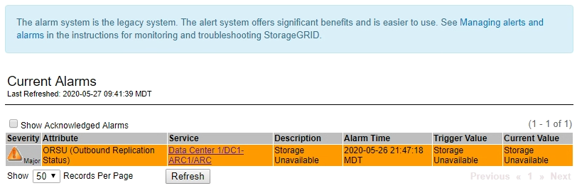

= Ver alarmas heredadas
:allow-uri-read: 
:icons: font
:imagesdir: ../media/

[role="lead"]
Las alarmas (sistema heredado) se activan cuando los atributos del sistema alcanzan los valores de umbral de alarma. Puede ver las alarmas activas actualmente desde la página Alarmas actuales.

NOTE: Aunque el sistema de alarma heredado sigue siendo compatible, el sistema de alerta ofrece importantes ventajas y es más fácil de usar.

.Antes de empezar
* Debe iniciar sesión en Grid Manager mediante un link:../admin/web-browser-requirements.html["navegador web compatible"].

.Pasos
. Seleccione *SUPPORT* > *Alarms (Legacy)* > *Current Alarms*.
+

+
El icono de alarma indica la gravedad de cada alarma de la siguiente manera:

+
[cols="1a,1a,1a,3a"]
|===
| . | Color | Gravedad de alarma | Significado 

 a| 
image:../media/icon_alarm_yellow_notice.gif["icono cuadrado amarillo"]
 a| 
Amarillo
 a| 
Aviso
 a| 
El nodo está conectado a la cuadrícula, pero existe una condición poco habitual que no afecta a las operaciones normales.

 a| 
image:../media/icon_alert_yellow_minor.png["icono de diamante naranja claro"]
 a| 
Naranja claro
 a| 
Menor
 a| 
El nodo está conectado a la cuadrícula, pero existe una condición anormal que podría afectar al funcionamiento en el futuro. Debe investigar para evitar el escalado.

 a| 
image:../media/icon_alert_orange_major.png["icono de diamante naranja oscuro"]
 a| 
Naranja oscuro
 a| 
Importante
 a| 
El nodo está conectado a la cuadrícula, pero existe una condición anormal que afecta actualmente al funcionamiento. Esto requiere atención inmediata para evitar un escalado.

 a| 
image:../media/icon_alert_red_critical.png["icono rojo x"]
 a| 
Rojo
 a| 
Crítico
 a| 
El nodo está conectado a la cuadrícula, pero existe una condición anormal que ha detenido las operaciones normales. Debe abordar el problema de inmediato.

|===
. Para obtener información acerca del atributo que provocó la activación de la alarma, haga clic con el botón secundario del ratón en el nombre del atributo de la tabla.
. Para ver detalles adicionales acerca de una alarma, haga clic en el nombre del servicio en la tabla.
+
Aparece la ficha Alarmas para el servicio seleccionado (*SUPPORT* > *Tools* > *Topología de cuadrícula* > *_nodo de cuadrícula_* > *_Servicio_* > *Alarmas*).

+
image::../media/alarms_acknowledging.png[Confirmación de alarmas]

. Si desea borrar el número de alarmas actuales, puede realizar lo siguiente de forma opcional:
+
** Reconozca la alarma. Una alarma confirmada ya no se incluye en el recuento de alarmas heredadas, a menos que se active en el siguiente nivel de gravedad o se resuelva y se vuelva a producir.
** Desactive una alarma predeterminada o Global Custom particular para todo el sistema para evitar que se active de nuevo.

.Información relacionada
link:alarms-reference.html["Referencia de alarmas (sistema heredado)"]

link:managing-alarms.html["Confirmar alarmas actuales (sistema heredado)"]

link:managing-alarms.html["Desactivar alarmas (sistema heredado)"]
