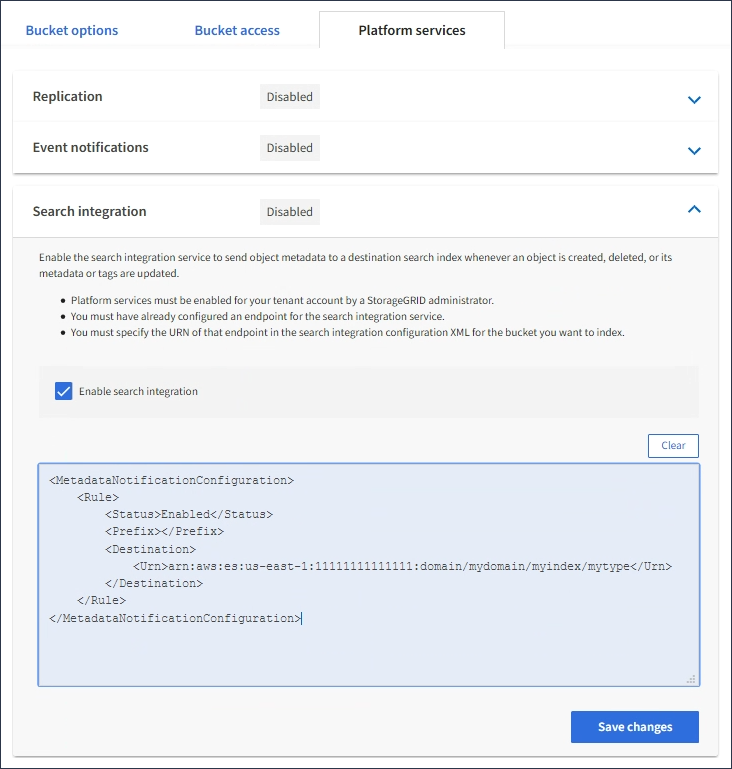

= Configure el servicio de integración de búsqueda
:allow-uri-read: 
:icons: font
:imagesdir: ../media/

[role="lead"]
El servicio de integración de búsqueda envía metadatos de objetos a un índice de búsqueda de destino cada vez que se crea, se elimina o se actualizan sus metadatos o etiquetas.

.Antes de empezar
* Un administrador de StorageGRID activó los servicios de plataforma para su cuenta de inquilino.
* Ya ha creado un bucket S3 cuyo contenido desea indexar.
* El punto final que pretende utilizar como destino para el servicio de integración de búsqueda ya existe y tiene su URN.
* Pertenece a un grupo de usuarios que tiene el link:tenant-management-permissions.html["Gestione todos los bloques o permisos de acceso raíz"]. Estos permisos anulan la configuración de permisos de las directivas de grupo o de bloque al configurar el bloque mediante el Administrador de inquilinos.

.Acerca de esta tarea
Después de configurar el servicio de integración de búsqueda para un bloque de origen, al crear un objeto o actualizar los metadatos o las etiquetas de un objeto se activan los metadatos de objeto que se enviarán al extremo de destino. Si habilita el servicio de integración de búsqueda para un depósito que ya contiene objetos, las notificaciones de metadatos no se envían automáticamente para los objetos existentes. Debe actualizar estos objetos existentes para asegurarse de que sus metadatos se agregan al índice de búsqueda de destino.

.Pasos
. Utilice un editor de texto para crear el XML de notificación de metadatos necesario para habilitar la integración de búsqueda.
+
** Consulte la información sobre XML de configuración para la integración de búsquedas.
** Al configurar XML, utilice URN de un extremo de integración de búsqueda como destino.

+
[listing]
----
<MetadataNotificationConfiguration>
 <Rule>
    <Status>Enabled</Status>
    <Prefix></Prefix>
    <Destination>
       <Urn>arn:aws:es:us-east-1:11111111111111:domain/mydomain/myindex/mytype</Urn>
       </Destination>
 </Rule>
</MetadataNotificationConfiguration>
----
. En el Administrador de inquilinos, seleccione *ALMACENAMIENTO (S3)* > *Cuchos*.
. Seleccione el nombre del bloque de origen.
+
Aparece la página de detalles bucket.

. Seleccione *Servicios de plataforma* > *integración de búsqueda*
. Seleccione la casilla de verificación *Habilitar integración de búsqueda*.
. Pegue la configuración de notificación de metadatos en el cuadro de texto y seleccione *Guardar cambios*.
+

+

NOTE: Un administrador de StorageGRID debe habilitar los servicios de plataforma para cada cuenta de inquilino mediante Grid Manager o la API de gestión. Póngase en contacto con el administrador de StorageGRID si se produce un error al guardar el XML de configuración.

. Compruebe que el servicio de integración de búsqueda está configurado correctamente:
+
.. Añada un objeto al bloque de origen que cumpla los requisitos para activar una notificación de metadatos tal y como se especifica en el XML de configuración.
+
En el ejemplo mostrado anteriormente, todos los objetos añadidos al bloque activan una notificación de metadatos.

.. Confirme que se ha agregado un documento JSON que contiene los metadatos y las etiquetas del objeto al índice de búsqueda especificado en el extremo.

.Después de terminar
Según sea necesario, se puede deshabilitar la integración de búsqueda para un bloque con cualquiera de los siguientes métodos:

* Seleccione *STORAGE (S3)* > *Buckets* y desactive la casilla de verificación *Enable search integration*.
* Si utiliza la API de S3 directamente, utilice una solicitud de notificación DELETE Bucket. Consulte las instrucciones para implementar aplicaciones cliente de S3.

.Información relacionada
link:understanding-search-integration-service.html["Comprender el servicio de integración de búsquedas"]

link:configuration-xml-for-search-configuration.html["XML de configuración para la integración de búsqueda"]

link:../s3/index.html["USE LA API DE REST DE S3"]

link:creating-platform-services-endpoint.html["Cree un extremo de servicios de plataforma"]
