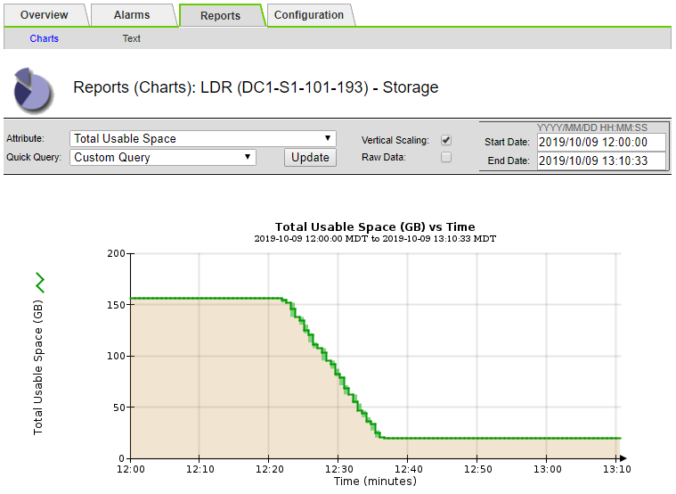

= Solucione los problemas de la alarma de estado de almacenamiento (SST)
:allow-uri-read: 
:icons: font
:imagesdir: ../media/

[role="lead"]
La alarma de estado del almacenamiento (SST) se activa si un nodo de almacenamiento no tiene suficiente espacio libre restante para el almacenamiento de objetos.

.Antes de empezar
* Debe iniciar sesión en Grid Manager mediante un link:../admin/web-browser-requirements.html["navegador web compatible"].
* Ya tienes link:../admin/admin-group-permissions.html["permisos de acceso específicos"].

.Acerca de esta tarea
La alarma SSTS (Estado de almacenamiento) se activa en el nivel de aviso cuando la cantidad de espacio libre en cada volumen de un nodo de almacenamiento cae por debajo del valor de la Marca de agua de sólo lectura suave del volumen de almacenamiento (*CONFIGURACIÓN* > *sistema* > *opciones de almacenamiento*).

image::../media/storage_watermarks.png[Información general sobre las opciones de almacenamiento]

Por ejemplo, supongamos que la Marca de agua de sólo lectura suave del volumen de almacenamiento se establece en 10 GB, que es su valor predeterminado. La alarma SSTS se activa si queda menos de 10 GB de espacio utilizable en cada volumen de almacenamiento del nodo de almacenamiento. Si alguno de los volúmenes tiene 10 GB o más de espacio disponible, la alarma no se activa.

Si se ha activado una alarma SSTS, puede seguir estos pasos para comprender mejor el problema.

.Pasos
. Seleccione *SUPPORT* > *Alarms (Legacy)* > *Current Alarms*.
. En la columna Servicio, seleccione el centro de datos, el nodo y el servicio asociados a la alarma SSTS.
+
Aparece la página Topología de cuadrícula. La ficha Alarmas muestra las alarmas activas del nodo y el servicio que ha seleccionado.

+
image::../media/ssts_alarm.png[Nodo de almacenamiento > LDR > almacenamiento > pestaña Alarms]

+
En este ejemplo, se han activado las alarmas SSTS (Estado del almacenamiento) y SAVP (espacio útil total (porcentaje)) en el nivel de aviso.

+

NOTE: Normalmente, tanto LA alarma SSTS como la alarma SAVP se activan aproximadamente al mismo tiempo; sin embargo, si ambas alarmas se activan depende del valor de la Marca de agua en GB y del valor de la alarma SAVP en porcentaje.

. Para determinar cuánto espacio útil está realmente disponible, seleccione *LDR* > *almacenamiento* > *Descripción general* y busque el atributo espacio útil total (STS).
+
image::../media/storage_node_total_usable_space.png[Espacio útil total]

+
En este ejemplo, solo quedan disponibles 19.6 GB del espacio de 164 GB en este nodo de almacenamiento. Tenga en cuenta que el valor total es la suma de los valores *disponible* para los tres volúmenes de almacén de objetos. Se activó la alarma DE SSTS porque cada uno de los tres volúmenes de almacenamiento tenía menos de 10 GB de espacio disponible.

. Para comprender cómo se ha utilizado el almacenamiento a lo largo del tiempo, seleccione la ficha *Informes* y Trace el espacio útil total en las últimas horas.
+
En este ejemplo, el espacio útil total cayó de aproximadamente 155 GB a 12:00 a 20 GB a 12:35, lo que corresponde al tiempo en que se activó la alarma DE SST.

+

. Para entender cómo se utiliza el almacenamiento como un porcentaje del total, graficar espacio útil total (porcentaje) durante las últimas horas.
+
En este ejemplo, el espacio total utilizable cayó de un 95% a algo más de un 10% aproximadamente al mismo tiempo.

+
image::../media/total_usable_storage_percent_chart.png[Espacio útil total (porcentaje): Gráfico]

. Según sea necesario, link:../expand/guidelines-for-adding-object-capacity.html["añadir capacidad de almacenamiento"].
+
Consulte también link:../admin/managing-full-storage-nodes.html["Gestione nodos de almacenamiento completos"].

